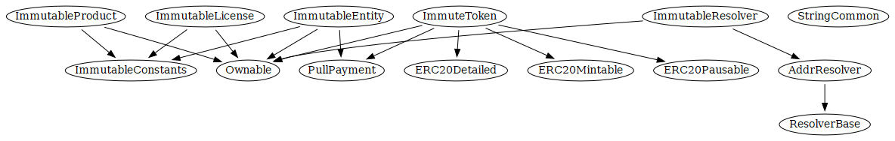
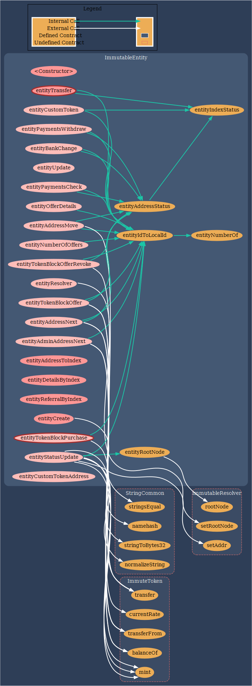

# ImmutableEcosystem

The Immutable Ecosystem is a hardware and language agnostic Ethereum based application store. This decentralized ecosystem has two main components, the Solidity smart contracts and the Distributed Application (Dapp). This repository is for the Smart Contracts only. The generated API documentation for the smart contracts is located in the 'docs' directory. The unit tests of the smart contracts are located in the 'tests' directory.

##  Bug Bounty 

A bug bounty is in effect for the smart contracts within the Immutable Ecosystem. Adopting vulnerability disclosure best practices we have followed the disclose.io [framework](./docs/core-terms-USA.md) to safeguard security researchers.

To receive the maximum payout the report should include a fix to the problem if possible. Specific payouts to the bug bounty depend on the severity of the bug as well as the general impact of the bug. In general, the theft of ETH, tokens or Entity accounts are considered of the highest impact. When calculating the severity and thus payout for report bugs we will utilize the common impact vs. likelihood chart below.

Exemptions: The ImmutableResolver and ENS smart contract integration is a WIP and not part of this bug bounty at this time. Additionally, bugs in the Solidity compiler, third party contracts (ERC20, ENS, etc.), or Ethereum and/or EVM in general are explicitly not permissible within this bug bounty unless the bug is directly caused by ImmutableSoft's use of these third party components. Also, bugs in the Dapp (once available) are not part of this bug bounty (but please report them if you find them ;-)

The procedure for reporting a bug is to create a Github issue and identify the general problem. To maximize your paybout you then have 15 days to further expand on and discuss the problem and/or develop a solution.  Please do not forget this first step so you can ensure your effort will be rewarded. Bugs discovered during the bounty are awarded in a first come, first served basis. No duplicate bugs will be rewarded, however additional explanations and/or solutions by others may result in the sharing of a particular bounty.

If you do not have time to write up a formal issue report, or wish to remain anonymous, you can submit your report through email. Send your submission directly to Security at ImmutableSoft dot org. Any submission that is acted upon by ImmutableSoft is eligable for a payout. If you wish to decline payment or receive your reward with tokens, please mention this in email.

## Overview

The Immutable Ecosystem is split into four Smart Contracts. The ImmuteToken is the ERC20 token that monetizes the Ecosystem. The ImmutableEntity handles registered orangizations (entities) within the Ecosystem. The ImmutableProduct is responsible for products and releases created by entities registered with the Ecosystem, including managing product release escrows. The ImmutableLicense handles the creation and validation of product activation licenses and the escrow accounts associated with end user purchases.

Below is the inheritance graph of the various Immutable Ecosystem smart contracts.

This project utilizes 'truffle' to build and test the solidity smart contracts. Typical usage after cloning the project includes the following commands issued in the base of the cloned directory. See https://www.trufflesuite.com/ for more information on truffle.

### npm install
### truffle compile --all
### truffle deploy --all
### truffle test

After contract deployment the following ImmuteToken contract initialization procedures are taken by the contract owner to make the Ecosystem operation. The first step configures and restrict the token to transfers only to or from the Ecosystem contracts. See the first and third javascript tests in the file test/TestImmutableEcosystem.js.

### restrictTransferToContracts(ImmutableEntity.address, ImmutableProduct.address, ImmutableLicense.address);

The last step configures the bank payable address paid on token purchases. Any use of the Ecosystem before these two steps are taken is not allowed.

### bankChange(ownerBank);

After these two steps the Ecosystem is ready for use.

## ImmutableToken

The ERC20 token used for the Immutable Ecosystem monetization of both product release escrows as well as product activation license escrows. To avoid persecution under ambiguous US securities laws, this token is restricted to transfers to and from the Immutable Ecosystem smart contracts only. No direct transfer of these tokens is allowed between third parties. This token is minted on demand with no hard cap and available for purchase in exchange for ETH at a fixed price.

The full public API documentation for this smart contract is available in the docs folder for [ImmuteToken](./docs/ImmuteToken.md).

The function dependency graph for the ImmuteToken smart contract is below.

## ImmutableEntity

Individuals and organization can register themselves as entities of either Creator, Distributor, or End User type. Each Entity is assigned a unique index within the Ecosystem upon creation. This index, as well as the Entity Ethereum wallet address, can be used to uniquely identify the Entity. This smart contract has an interface for the resale of tokens as well as the configuration of an ETH bank account that will be paid out too. It also acts as an ENS resolver for the immutablesoft.eth ENS domain.

The full public API documentation for this smart contract is available in the docs folder for [ImmutableEntity](./docs/ImmutableEntity.md).

The function dependency graph for the ImmutableEntity smart contract is below.

## ImmutableProduct

The ImmutableProduct smart contract has interfaces to allow registered entities to create new products and product releases, funding those releases with an escrow holding tokens. Nonprofit creators have this escrow minted for them while commercial creators must transfer tokens to the product release escrow. This contract also handles end user download and authentication verification interfaces as well product release challenges. End users can use this contract to ensure authentic installation of products and to report any discovered file hash mismatch and be rewarded with one half of the outstanding escrow.

The full public API documentation for this smart contract is available in the docs folder for [ImmutableProduct](./docs/ImmutableProduct.md).

The function dependency graph for the ImmutableProduct smart contract is below.

## ImmutableLicense

The ImmutableLicense smart contract provides interfaces for purchasing product license activations as well as for verifying prior activations. Each product can be listed for sale at a price set by the creator and end users can directly purchase activation licenses to automate the sales process. There is also the capability to move a product activation license to a new system (new computer, etc.) as well as resell the product activation license to a third party (if allowed by the creator). This full service interface gives the end users control while automating the sales and maintenance processes for creators.

The full public API documentation for this smart contract is available in the docs folder for [ImmutableLicense](./docs/ImmutableLicense.md).

The function dependency graph for the ImmutableLicense smart contract is below.

