# Immutable Ecosystem Documentation


## Contents

[Why the Immutable Ecosystem?](##why-the-immutable-ecosystem?)

[Web3 Provider Requirement](##web3-provider-requirement)

[Part I: End User](##part-i:-end-user)

  [The User Interface](###the-user-interface)

  [Download And Verify](#download-and-verify)

  [Purchase Tokens](#purchase-tokens)

  [Purchase an Activation License](#purchase-an-activation-license)

  [Change a Product Activation Identifier](#change-a-product-activation-identifier)

  [Resell Activation License](#resell-activation-license)

[Part II: Digital Creators](#part-ii:-digital-creators)

  [Creator Requirements](#creator-requirements)

  [The Registration Process](#the-registration-process)

  [The Product and Release Interfaces](#the-product-and-release-interfaces)

  [The Product License Offer Interface](#the-product-license-offer-interface)

[Part III: Monetization and Configuration](#part-iii:-monetization-and-configuration)

  [The Token Block Offer](#the-token-block-offer)

  [Token Escrows](#the-token-block-offer)

  [Entity Configuration](#entity-configuration)

[Part IV: Developers and Embedding](#part-iv:-developers-and-embedding)

  [Product Links](#product-links)

  [Entity Links](#entity-links)

  [Activation Validation](#activation-validation)

## Why the Immutable Ecosystem?

The immutability and decentralized security of the blockchain provides the independent root of trust that is leveraged by the Immutable Ecosystem for the benefit of digital product consumers and creators alike. Commercial or nonprofit, this ecosystem can automate digital product distribution and sales processes for digital content creators. In the most simplistic terms the Immutable Ecosystem (ie. Ecosystem) is a decentralized Digital Product and Activation Asset Store (or App Store) whose database is the blockchain. If this still sounds complicated let us paraphrase. The [Immutable Ecosystem](https://ecosystem.immutablesoft.org) means trust. Trust that users download the digital product exactly as released by the digital creator. Trust that users can purchase digital product activations as depreciable assets with resale rights. Trust that digital creators are supremely compensated for all user activation purchases. Trust that the digital activation resale process is auditable and designed to prevent fraud. Trust that no central authority will exist to impose its financial or political insecurities upon the digital creator community.

Not convinced? Please read the [Immutable Whitepaper](https://immutablesoft.org/whitepaper/) for more information.

## Web3 Provider Requirement

The Immutable Ecosystem interfaces with the Ethereum blockchain as a web Dapp. Each user or creator is identified within the Ecosystem Dapp using their Ethereum wallet address through a Web3 provider. The Web3 provider is the bridge between an Ethereum network and the web Dapp. The provider must be installed and active on an Ethereum network for the browser to access the Immutable Ecosystem. For the PCs, the Brave Crypto Wallet, or any browser with the MetaMask plug in, are recommended. For mobile devices there are more limited options with most still under development. A Web3 provider connects a wallet to an Ethereum network and gives access to the Immutable Ecosystem. The Web3 provider empowers the browser by giving it read and write access to an Ethereum blockchain using the user’s wallet.

Using the address of your wallet as unique identifier, the Web3 provider is a secure method of interacting with distributed and decentralized applications (DApps) such as the Immutable Ecosystem. While an Ethereum wallet and Web3 provider are required in order to read from the blockchain and access the Ecosystem, there is no requirement to purchase any Ethereum or IuT tokens. ETH and other tokens are only needed if the user wishes to purchase an activation license for a digital product within the Ecosystem. Users can use the Ecosystem to search for and download/verify as many products as they want free of charge. The Ecosystem is designed to be freely integrated with third party build tools to validate external dependencies during download/build/install processes.

When your Web3 Provider enabled browser opens the [Immutable Ecosystem](https://ecosystem.immutablesoft.org) for the first time, the Web3 provider (MetaMask, etc.) will display a connection Notification between the Ecosystem and your Ethereum wallet, similar to this.

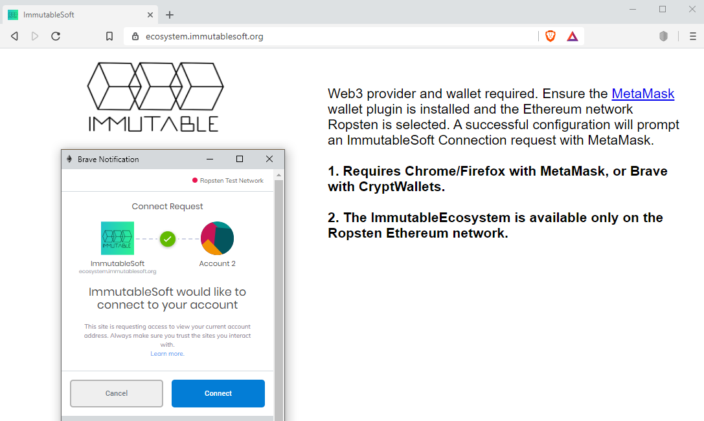

To protect your wallet, all connections and blockchain writes will result in a Web3 provider Notification. Never approve any Web3 provider Notification that you did not initiate. Currently the Immutable Ecosystem is available on Mainnet (TBD) and Ropsten Ethereum networks. Once your Web3 provider is on the Ropsten Ethereum network and at ecosystem.immutablesoft.org, press the Connect button on the MetaMask Notification to give access and allow the Dapp to load.

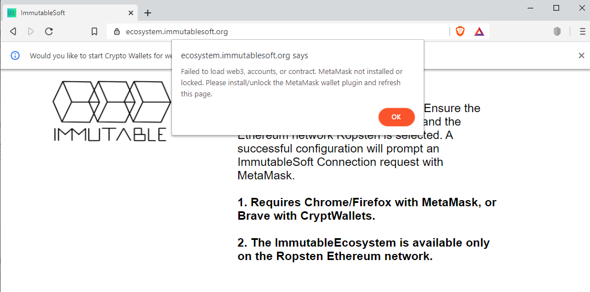

If you get the above web page instead of the MetaMask Connect Notification and you have MetaMask plugin installed, you might be on an unsupported Ethereum network. Be sure to choose the Ropsten Ethereum for testing and the Mainnet Ethereum network for production.

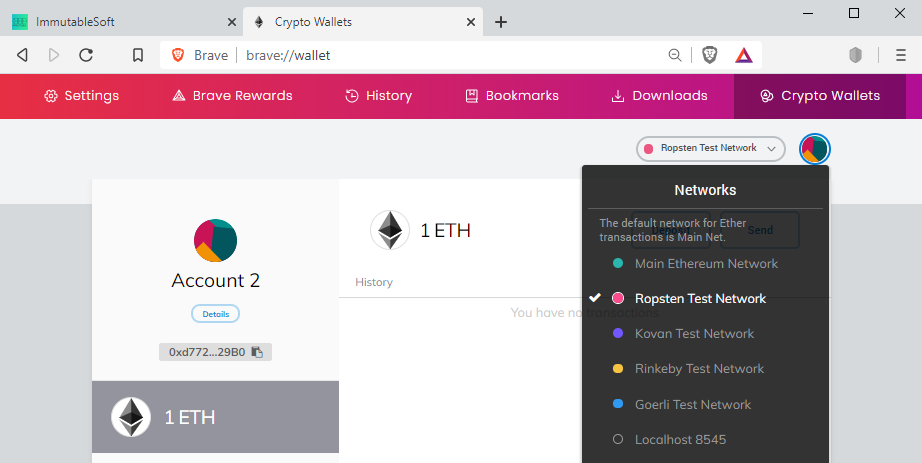

## Part I: End User

The primary goal of the Ecosystem is to allow users to download, authenticate, install and purchase digital product activation assets safely and directly with the original digital creator. The Immutable Ecosystem allows users the ability to browse for all types of digital products. The goal of the Applications menu interface is to help users find their digital products quickly so they can install and purchase/activate those products securely. Each product displayed in the ecosystem has the product name, logo and link to the product website to learn more about a product before downloading.

### The User Interface

Once a browser has MetaMask installed and the Connect to MetaMask is approved for the Immutable Ecosystem and Ethereum network, the [Ecosystem](https://ecosystem.immutablesoft.org) will come alive when you browse to it.

If everything is working you should see the website with the top banner displaying something like this.


In the image above, the top bar contains the main menu button on the left and a global search box to quickly find an organization or product. On the right of the Immutable top banner is the current balance of Immute tokens in the Web3 Account followed by the balance of ETH. For now we have no need for tokens so let’s ignore the Add Tokens button on the far right.

On the main Applications page, just below the top bar is the currently Showcased entity and their applications. The Showcased entity changes to a different entity with products every hour. Below the Showcased entity is a drop down list of license types and application categories. Below this is all the applications of the Ecosystem. Selecting a license type or category limits the displayed applications those of that license or category only. Clicking on an application, either in the featured entity or below, opens the interface to that particular digital product.

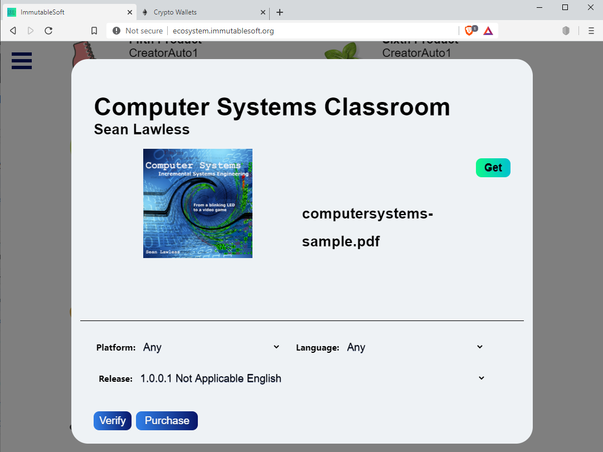

In the product interface above the Version and Type list box will become populated with all available release versions and hardware platform types. If the “All Platforms” selection in the left list box is changed to a particular platform type, only release versions for that platform will be displayed. By default the most recently created releases are displayed in the list first, which are presumably the most recent releases of the software product.

### Download and Verify

With a product selected, the Application interface shows a primary Get button is on the right and the Verify button below. To download the latest release file select the platform and press the Get button. Save the resulting file download and remember the name and location of the it. To verify the download, press the Verify button and select the local file that you just saved. The verification process will notify you if the file is authentic or not.
 
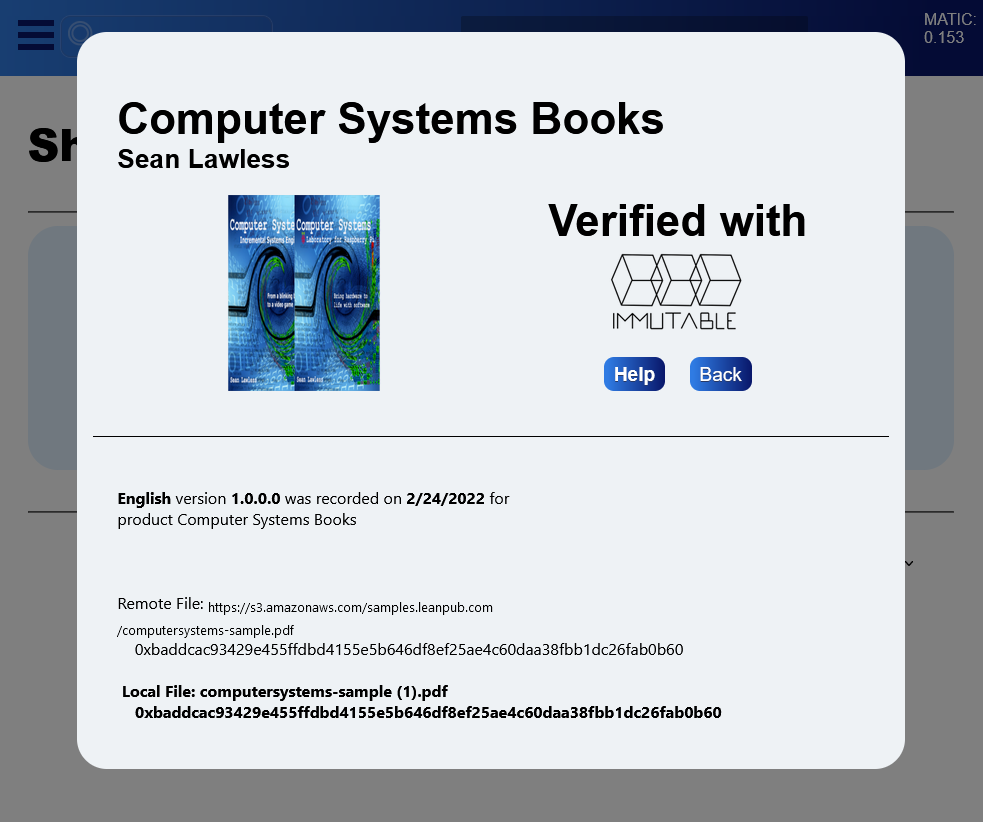

Above is a screen shot of what to expect after selecting the Firefox application, Getting the release file and performing the Verify process on the file that was just downloaded. Note that the product button is highlighted (black outline) and should match between the product download URI and the locally saved file. After verifying the integrity of the downloaded file  it is safe to execute, install and use the downloaded product. The Immutable Ecosystem does not safeguard the user from network or email based attacks and is NOT a replacement for anti-virus software.

### Purchase Tokens

Before we can purchase an activation license with tokens, we must first purchase tokens. With either a registered or unregistered Ethereum address you can exchange ETH for tokens by pressing the Add Tokens button on the right side of the top menu bar. This button will open an interface that will allow your Ethereum wallet to transfer ETH in exchange for new tokens from ImmutableSoft, or to exhange for a block of tokens from a registered entity that has offered tokens for sale.

When exchanging ETH for tokens, the ETH rate multiplier sets the current token price. The value of ETH sent is multiplied by the ETH rate multiplier to equal the number of tokens received in the exchange. The multiplier set by ImmutableSoft for new tokens will be periodically updated to maintain a cost per token of approximately 25 cents USD. Each token offer can set their own rate multiplier and the highest rate equals the lowest cost.


### Purchase an Activation License

If the digital product is commercial and the creator has configured an activation offer, the Purchase button will appear to the right of the Verify button. The Purchase button displays the digital product specific offers, a number of tokens for an activation time period defined by the digital creator. For a registered and approved Ecosystem end user or distributor, each digital product activation purchased includes the right to resell which transforms the activation into an asset. For unregistered users, once an activation is purchased there is no way resell it, even if you register later. Registration is free* (a small amount of ETH gas is required) so we highly recommend users register before purchasing activation licenses. To register with the Ecosystem see Part II, section [The Registration Process](#the-registration-process).

The purchase activation procedure follows installing and executing the downloaded and verified digital product release. Then upon execution, the installed product should display URL link to the Ecosystem containing a unique identifying number. If not, the identifier must be copied, without error or omission, to this Purchase an Activation page. The software must be installed and executed on the platform the activation is to effect as the identifier used for activation is hardware specific. Be sure to read and understand any product specific restrictions or instructions before purchasing an activation license. Immutable cannot refund a license activation purchase, although your tokens were sent to the software creator so a refund from them is entirely possible.

The product activation identifier is calculated to be repeatable and unique per product and per hardware system it is executed upon. Because it depends on unique hardware identifiers it is important to avoid the use of externally connected hardware when executing the software for the first time and generating the activation identifier. If the installed device is a laptop for example, disconnect it first from any docking station before executing the software and generating the activation identifier. The device hardware present during initial activation must continue to be present to ensure no change in the identifier at a later time. Hardware can be added later after activation (plugged into the docking station), but any removed hardware may cause the activation identifier to change. If this does occur (hardware upgrade, etc.) the activation license can simply be moved to the new identifier (see next section).

Follow the application link, or copy the unique activation identifier from the digital product to the Purchase an Activation License form, select the offer (standard or promotion) and submit the activation purchase with the Purchase Activation button. You will need to wait until the the activation is written to the blockchain before continuing. Once the transaction is written to the blockchain a restart of the digital product should succeed and the application be ready to use.


### Change a Product Activation Identifier
 
At any time before expiration the product activation identifier can be changed. This allows the end user to upgrade computer hardware for example, and then reactivate the digital product (software) with their new identifier. This feature can also be used to loan an activation to a friend or colleague while still retaining ownership (the ability to change the identifier again at any time). To update to a new identifier select the Activations menu option. A list of purchased activations should be presented. Select the product activation to change and input the new identifier, obtained from executing the digital application, and press the Change button. To prevent abuse and discourage a short term rental market, one (1) token is charged whenever an activation identifier is changed.
 
By design, when an activation identifier is changed, the old identifier is no longer valid. When an activation is offered for resale (see section below) the current identifier remains valid and will continue to activate the digital product and can still be changed with this interface. However, once the activation license is purchased by another user (see section below) the activation identifier will be changed to that specified by the new owner and the old identifier will no longer activate the digital product.


 
### Resell Activation License

At any time before an Activation license expires, a purchaser registered with the Ecosystem may offer the remaining time of a digital activation for resale within the Immutable Ecosystem. From the Activation menu, select the purchased activation to enter the Activation interface. Press the Resell button to open the Resell inteface. Enter an resale offer price, in whole tokens, and press the offer for Resale button.
 
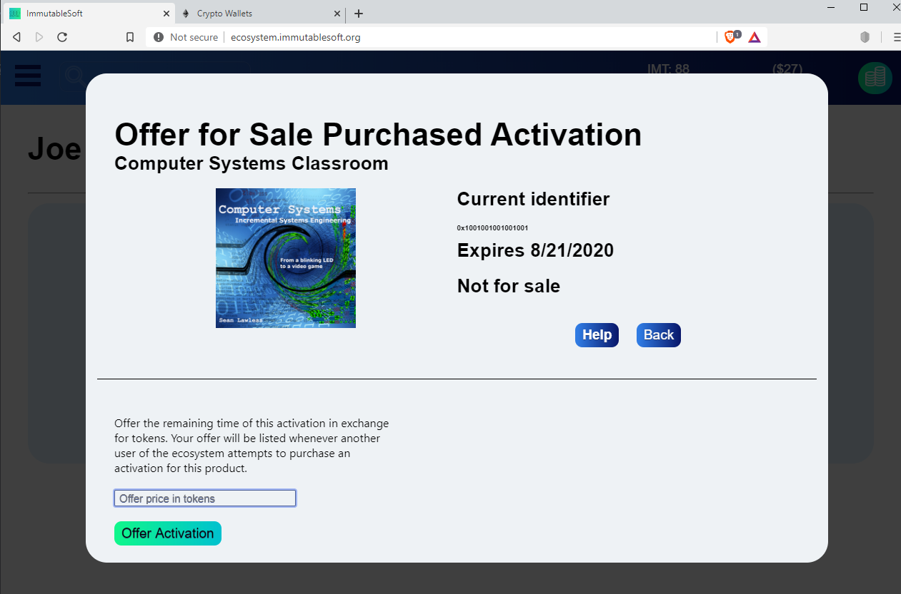

Once a purchased product activation is offered for resale, it will appear in the activation resale offer list on the Purchase Activation License interface whenever others using the Ecosystem wish to activate that particular product. If the seller does not have an active subscription with the Immutable Ecosystem, a 1 percent fee is charged the seller whenever an activation resale offer is purchased. The purchaser is unaware and unaffected by this fee although an event audit will show this fee transfer.

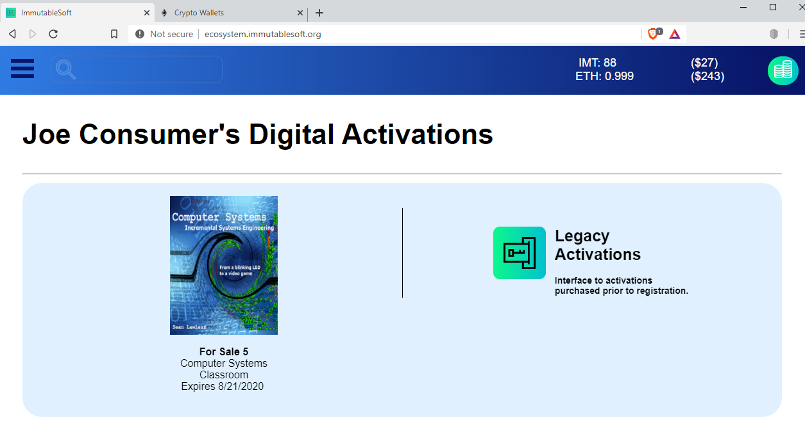

Allowing a purchaser to securely and safely resell a previously purchased digital product activation license turns it into an asset of depreciable value similar to a bike, appliance or car. We at Immutable believe the decentralized assetization of digital activation licenses is an empowering technology that will change the future of software for the better. Go to the Configure menu page and Register with the Immutable Ecosystem today.

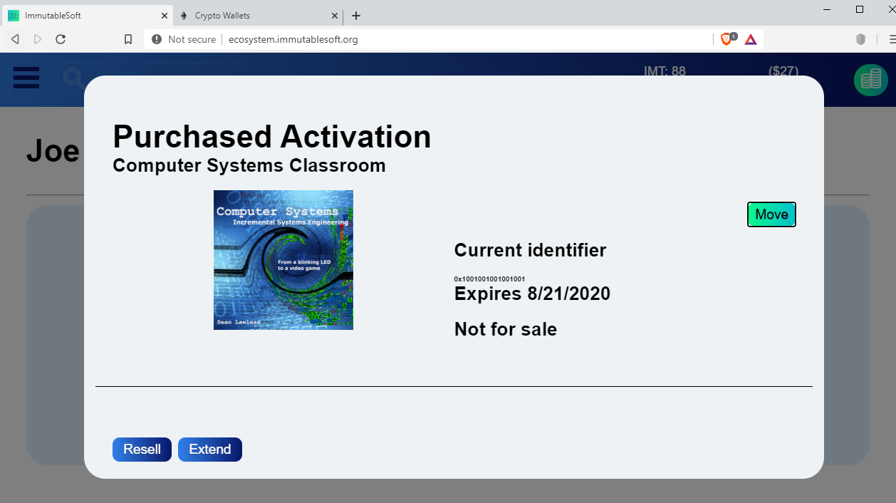

## Part II: Digital Creators

### Creator Requirements

A digital creator, in order to best use the Immutable Ecosystem, should have an existing web presence with a URL specific to each product that provides a description of the product. ImmutableSoft also recommends a product logo URL that is used for users to visually identify the product. Finally, a URI for each specific product release which must remain available for one year in order to earn escrow rewards. In some scenarios commercial software does not have direct URIs for download but instead requires the user to first register themselves for access to a unique URI. In these cases each release URI should be a URL leading the user to the start of the registration process. The requirement here is that the registration process must lead to a download of a file that can be identified within the Immutable Ecosystem and whose checksum can thus be verifiable after download.

The registered administrator Ethereum wallet address for the Entity and a Web3 provider (MetaMask, Brave, etc.) is required on make changes to digital products. The Entity administrator wallet is your secure identity on the blockchain, turning this wallet private key into the digital product release signing key. This allows a software creator to use a $100 commercial Ethereum hardware wallet to achieve a similar level of operational and distribution security as a $10,000 Hardware Security Module (HSM).

### The Registration Process
 
Before a digital Creator can begin to utilize the Ecosystem for digital distribution and sales, it must register their administrator Ethereum account address with the Immutable Ecosystem, along with their entity name, URL and optional referral entity. Drop down the menu and open the Configure page of the Immutable Ecosystem and press the Registration button. Please follow the instructions as this is a two step process, first writing the public information to the blockchain (name, URL) to prove ownership of your administrator Ethereum account. The second step is to then privately submit your contact information so ImmutableSoft can verify and activate your account. Be sure the active MetaMask Ethereum account address is the one you wish to use as the administrator for the registering entity. You can change the registered entity Ethereum account address at any time after registration, see Part III [Entity Configuration](#entity-configuration). Be sure to complete both steps of the registration process or your application will not be complete.

The first requirement for a digital creator is to register your Entity (individual, organization or company) using the Ethereum Account that is to become the administrator for the Entity. Whatever Web3 account and network is currently active in MetaMask will be used for the registration.


The registration page looks something like above. After writing your Entity name and URL to the blockchain and thus demonstrating your ownership of the wallet address, you will be redirected to the main immutablesoft.org website to submit your private contact information. The Entity name and your Ethereum Account address should be auto populated. Be sure to check the email or voicemail submitted for communications from ImmutableSoft as we will be following up and verifying your information.

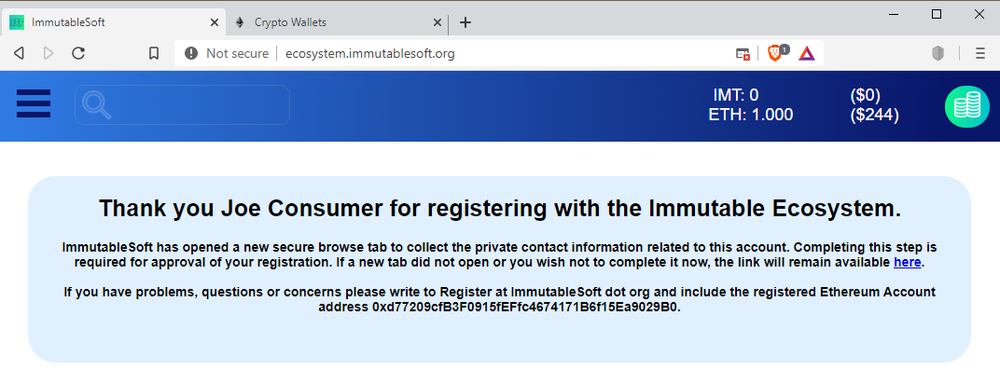

After registering your Entity with the Immutable Ecosystem, the Configure page and Registration interface should display something like above and a second tab opened in the browser for the Entity to submit their private contact information. If this second private contact information form is closed on accident, or you wish to resubmit or delegate this step, the link to submit your private information can be found on the Configure, Registrations page (in the Thank You note). A registration will be unapproved and incomplete until private contact information has been submitted on behalf of a Registered Entity and verified by ImmutableSoft.


### The Product and Release Interfaces

Once an Entity registration is approved the menu options Activations, Products (if Creator) and Token Offers appear when the Ecosystem is browsed with the Web3 account used for registration. Your Ethereum wallet becomes the access control mechanism to the Ecosystem, there is no login process and ImmutableSoft never knows your password or secret keywords. Each page in the Dapp menu provides a unique interface. The Products menu shows all products created by the Entity and allows the creator to Edit, set Licensing terms or create a New Release of the product.

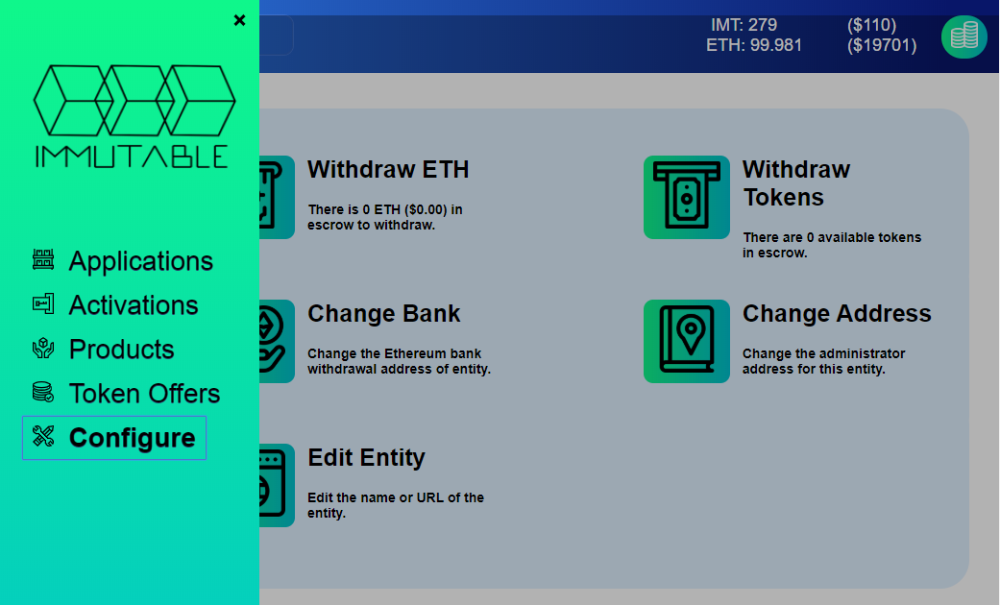

The first step is to create our first product by pressing the New Product button. In this example it will be the fictitious sound editing tool Melodicious. In the example above the product name, details URL and logo image URL are defined for the Melodicious application. No restriction check boxes are set and the languages of the product is set to English only (languages is a multi-select box). Finally the category of Entertainment is chosen as it reflects the most popular category of uses of the product, although not the only category. The logo URL will be previewed in the New Product interface upon entry to avoid mistakes prior to writing the transaction to the blockchain. The completed new product interface, before submitting, would look similar to this picture.


After a product is created a new release for that product can be created. In the Product menu page, click on the product and then press the New Release primary button on the right. In the below New Release interface, the file checksum must be a SHA256 of the URI file, in hexidecimal format (begins with 0x…). One token (~.$25) is required in each release escrow as a challenge incentive for anyone who detects a change in the release file. The minimum escrow is 1 token and there is no maximum. Do not make the escrow too high as it may incentivize others to attack the product website to modify file(s) and claim the escrow(s), an act that is very much against the rules of Immutable but may be hard to prove. The URI to download the file begins with https (a secure URL), the version is in dot notation (1.1) and the platform of the release is for Windows on x86 hardware. Once New Release is clicked there will be an alert that displays the data for verification.
 
After reviewing this information and pressing Ok, MetaMask will pop up a blockchain write verification notification. Edit the gas, select Slow speed (to minimize gas costs) and Approve the transaction. The new product should become visible in the Ecosystem on a fresh page load. Selecting Melodicious will display the Product interface page with the Get primary button on the right and Verify button on the bottom left. Congratulations, we have created a digital product and release with the Immutable Ecosystem.


Note that any icon we chose is scaled to fit 192x192 pixels or smaller in the Ecosystem. The logo URL should be in icon (square) format and at least 196x196 pixels but will scale any image, larger or smaller. If your digital product is released free of charge or your product will not be selling activations on the Immutable Ecosystem, this is the last step needed for a creator to distribute their software to the world. As new releases of your product come to fruitation you can revisit the Ecosystem and add them. Better yet to add a step to your release process that auto-populates a New Release page to nearly automate the process. See Part IV section [Product Links](#product-links) for more information on embedding links into the Immutable Ecosystem.

### The Product License Offer Interface

Commercial software creators can include the Immutable library into their application to securely verify activation licenses on the blockchain, allowing the automation of product activation sales directly to end users. Transferring tokens (or ETH) from the user directly to the software creator in exchange for the creation of an activation license on the blockchain that will result in the unlocking of the software product. This section of the document will describe creating offers and automating the sales of activation licenses for your products. Once the Immutable activation check is integrated into your digital product the sales process can become automated as the application can verify activation licenses at run time. 

A digital product activation license becomes an asset if it can be resold. However, digital creators are cautious about losing out on sales revenue. Limiting each activation license to an immutable expiration time that is unaffected be resales, it is possible to accommodate the resale community while boosting revenue. Raise your prices if need be since the digital activation is worth more as an asset that can be resold. Not to mention that everyone will purchase the more expensive multiyear promotional offer, if they know they can easily sell the remainder at any time. By selling digital activation assets your organization is selling a premium product.

Each product can have up to two (2) activation license offers outstanding at any one time, a standard offer and a promotional offer. Each offer has a cost in tokens and a time period (in days) the activation is valid for. Once purchased the time period is added to today’s date and immutably written to the blockchain as the expiration of the license. The offer scenario shown below has a standard 1 year activation for one price (200) and a promotional 2 year activation rate at another price (300).

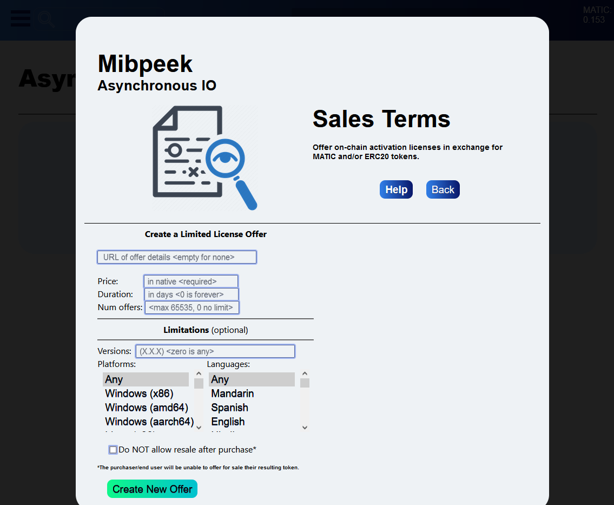

To accept tokens as payment for secure digital product activations requires a software or digital product release to use the Immutable license activation library in a manner which cannot be easily reverse engineered or bypassed. Typically compiled software complicates reverse engineering but a scripting languages are secure if the execution environment is secure, such as running on a secured server. The digital product release creator must add our library to their digital product (software, etc.) to verify the activation is valid (or at login if a web server or password based activation). During this validation step the following will occur in order:

1)	The software will compute a unique identifier for the executing system based on hardware identifiers. This identifier will be unique and compute to the same value every time a digital product is executed on this platform (digital product, OS and hardware specific).

2)	The digital product, upon startup, must compute this identifier and then verify if it can be found on the blockchain (is activated). If found to be active (present and unexpired) the digital product would allow execution, othwerwise the application should redirect execution to a purchase screen and/or halt execution. Immutable provides open software libraries and examples to do the secure blockchain activation check, but integrating with your software products is required.

For more information on how to validate an activation license on the blockchain within your digital product, see Part IV [Activation Validation](#activation-validation).

## Part III: Monetization and Configuration

Since ImmutableSoft is a US organization we are required to follow FEC/FinHub guidelines that essentially prevent a freely exchangeable token without registering the token as a security (an expensive legal process). To attempt to conform to SEC legal quidelines, ImmutableSoft is following all three core FinHub recommendations for ensuring a token is a utility token; a fixed value, specific use and restricted transfer rights. Tokens are fixed at $.25 and can ONLY be transferred to, from or used by the Immutable Ecosystem smart contracts. We hope to collect enough revenue to one day hire a legal team to navigate a path toward removing this restriction and allow an Immute token to be freely transferrable. We have a clear technological path to do so but are awaiting interest and participation from an active user base before incurring this expense. For now, the only way to transfer tokens is within the Ecosystem by purchasing tokens, purchasing activation licenses with tokens, and creating/purchasing token block offers. For ease of management and continuity it is also possible to transfer tokens whenever a registered and approved Entity changes their address (see [Entity Configuration](#entity-configuration) below).

### The Token Block Offer

Converting between ETH and Immute tokens is required for Entities to monetize their digital products. Purchasing tokens exchanges ETH for tokens. To convert earned or excess tokens back into ETH requires the Entity to create a Token Block Offer. Token Block Offers put an Entities tokens into escrow within the smart contract and list those tokens as available in exchange for ETH for anyone else to purchase.

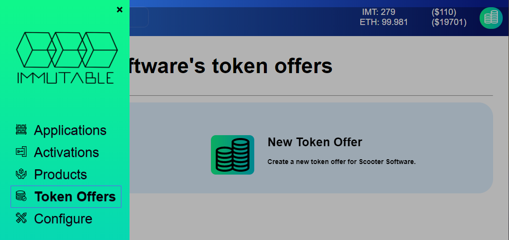

The ETH rate multiplier value is multiplied by the amount of ETH transferred to equal the number of tokens purchased. The number of tokens available for purchase from a token block offer is a multiple of the block size of the offer. The block size offered by an Entity is commonly the size of their products’ purchase price, or a common price point. The number of blocks is the number of tokens blocks available within a single offer. The number of blocks multiplied by the block size is the number of tokens transferred to escrow upon successful creation of the token block offer. As blocks are purchased from this offer, the number of blocks and escrow values decrease until the offer is exhausted. It is also possible to Edit an offer and change the number of blocks by transferring tokens to or from the token block offer escrow, however, the block size of an offer cannot be changed.


Since ImmutableSoft only provides bonus tokens for large purchases there is room for a robust token resale market for smaller token sizes. The current ImmutableSoft ETH rate multiplier is displayed in the interface and any token block offer must be equal to or larger than this value, meaning any token offer must be priced as less expensive than purchasing from ImmmutableSoft. This ensures the token offer is competitive while preventing upward price movement of the token. At any time prior to purchase an Entity can revoke an offer, which will move the tokens from escrow back to the Entity address.


To view the details of a token offer, click it from the display list of tokens (see picture above). This will bring up the Token Offer details page that allows Revoking or Editing a Token Offer.


It is possible to Edit a previously created token offer to add or remove blocks of tokens or change the exchange rate relative to ETH (the ETH multipler rate).


### Token Escrows

The Immutable Ecosystem manages two escrow accounts for each registered and approved Entity. The first escrow account is for ETH earned from the sales of token block offers (or activation purchases directly with ETH). The second escrow account is for Immute tokens earned from Product Release escrows that have matured. Escrows deposited into product releases are refundable from the Ecosystem after maturity, ie. one year. Matured product release escrows are still available for challenge until they are withdrawn from escrow. Purchases of product activation licenses result in the direct transfer of tokens from the purchaser to the creating Entity, without the use of an escrow.

Tokens earned by creators through product activation sales within the Ecosystem are monetized back into ETH through the sale of token block offers. The sale of token blocks will increase the Entities ETH escrow and the ETH can be periodically transferred out of this escrow into the Entity bank address, where it can exchanged for local currency through an exchange as desired.

Token Escrows can be viewed at the top of the Configure page, Withdraw ETH will withdraw ETH from token sales escrow, and Withdraw Tokens will withdraw Immute tokens from matured product release challenge escrows. Navigate to the Configure page with the menu botton on the top left.


### Entity Configuration

There are three Configure features for registered and approved Entities of the Ecosystem. Choosing Configure from the menu will open the Configure page (see picture above) which itself has interfaces to changing the ETH bank address, Entity address, or updating the Entity information itself. The Entity bank address is the recipient when transferring ETH out of the escrow of an Entity in the Ecosystem. The Entity bank address default is the Entity administrator address but can be changed at any time. Be sure to withdraw any ETH before changing the bank address or you will have to change back to to the old address in order to withdraw the ETH.
 


Due to organizational or security reasons Entities may wish to change the Ethereum address they have registered as the owner (Administrator) of the Entity within the Ecosystem. For safety reasons (to prevent the loss of ownership), changing the address of an Entity is a two-step process. The first step is to use the current address and submit a transaction with the new address, proving that the current Entity owner is intending to move to the new address. During this first step the Admin can also choose to move the tokens as well (or not).
 
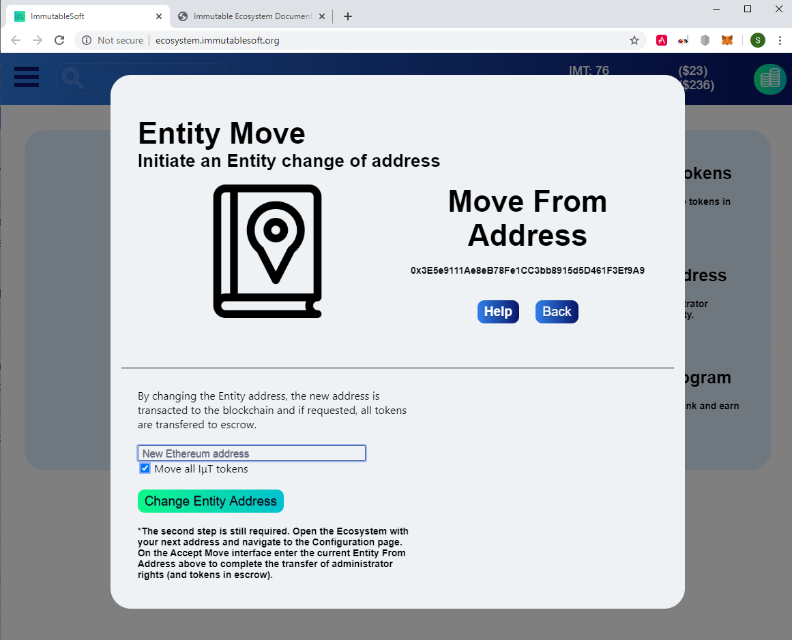

The second step is to use the new Ethereum address and access the Immutable Ecosystem. This address should be unregistered and on the Configure page is a button to Accept Entity Move. Press this Accept the Entity Move button and then enter the old address and press the Move button. Once the new Ethereum address has completed this second step the new address will be recognized by the Ecosystem as the Entity Administrator, and any tokens will be transferred if selected in the fist step.
 
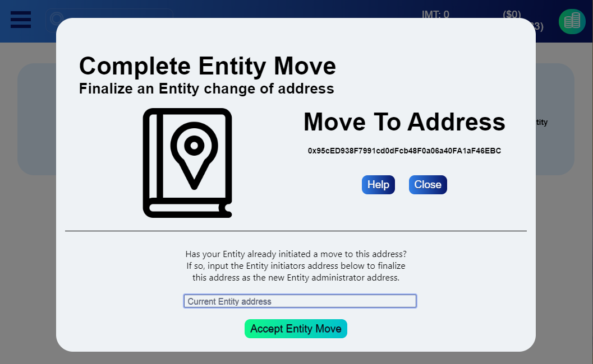

With this two-step process, if there is a mistake with Step 1 then it can be resolved by the Entity. Only once an Entity has demonstrated they have possession of both Ethereum addresses (and associated keys) will an Entity address by changed. Step 1 can be repeated as many times as necessary and can even be performed ahead of time as a managerial escape hatch. However, if tokens are transferred to escrow as part of Step 1, they remain in escrow until Step 2 is completed. The tokens in Entity escrow are correctly maintained even if multiple transactions for Step 1 are performed.

To update the Entity public information such as the name or URL of the Entity, select the Edit Entity and fill in the new Entity information and press the Update Entity button. Updating the Entity public information resets the Entity back to unapproved status and requires ImmutableSoft validation. To ensure prompt approval please send an email to register@immutablesoft.org describing the nature of the Entity change. Sending this email and receiving a response BEFORE updating the Entity information is recommended for fastest re-approval.

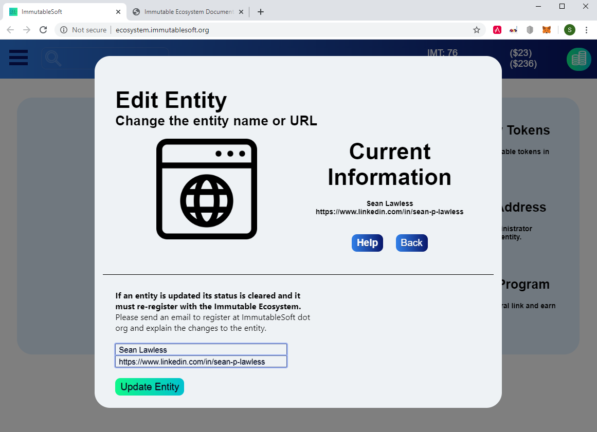

## Part IV: Developers and Embedding

The Immutable Ecosystem is designed to integrate with digital product creator websites by embedding simple HTML links with query strings. Every function of the Ecosystem is potentially supported, from Download and Verify to Purchasing an Activaiton. The Ecosystem uses standard HTML query strings to pass the function and function parameters to the Ecosystem for execution and presentation.

There are two main types of embedded functions, entity and product. Entity functions are specific to only an Entity and require and Entity ID parameter. Product functions are specific to an Entity and product so require both an Entity ID and a Product ID. For example, the Registration process has an embeddable function so that an Entity an auto populate their Entity ID as the referral so those who sign up through this link generate a referral bonus for the Entity providing the link. This is an Entity specific function and the Entity ID parameter is needed to auto populate the referral when opening the Registration page through this link embedded on a creators website.

The Entity specific embeddable links have examples auto generated within the Ecosystem and available on the Configure page, Promoter button. The Product specific embedded links into the Ecosystem are generated and available on the Products menu. Select the product and at the bottom near the Edit button should be an Embed button. This will open an interface providing examples of the different functions and query string interfaces. Cut and paste from here to the creators web site. The Ecosystem supports being opened in an iframe so that there is no need for the web browser to ever leave the creators website to use the Ecosystem.

### Entity Links

Below is a list of the Entity specific functions and parameters currently supported by this embed interface.

Registration with referral

```html
https://ecosystem.immutablesoft.org/?func=registration&entity=<entity ID>&referral=<referredBy>
```

### Product Links

Below is a list of the Product specific functions and parameters currently supported by this embed interface.

Purchase a License Activation

```html
https://ecosystem.immutablesoft.org/?func=activation&entity=<entity ID>&product=<product ID>&identifier=<id>&promo=<promotion>
```

Donate to a Product/Entity

```html
https://ecosystem.immutablesoft.org/?func=donate&entity=<entity ID>&product=<product ID>
```

Open Product Release page for Download and Verify

Example below is for the latest release. Leave the arch option blank for the default (auto detect) architecture.

```html
https://ecosystem.immutablesoft.org/?func=release&entity=<entity ID>&product=<product ID>&arch=<HWArchitecture>
```
Or to open the Product Release page for a specific release.

```html
https://ecosystem.immutablesoft.org/?func=release&entity=<entity ID>&product=<product ID>&release=<release ID>
```
### Activation Validation

The activation check with the blockchain is typically done with a secure HTTPS request to an Infura node controlled by the digital product creator. For production releases a creator should register with Infura and receive a Product ID for their application to use to access the blockchain. While ImmutableSoft has and may have shared their Infura Product ID for testing, it is capped at 100,000 requests and could reach a limit and prevent activation checks and thus your application from working. It is recommended that each product, and required that each entity, use their own [Infura](https://infura.io) account when integrating the Immutable library for activation checks within their application.

Below is an example use the curl HTTP command line browser to query the Ropsten Ethereum testnet blockchain (using an Infura node), and check the validity of a license activation identifier. This example is for the Windows shell and requires escape characters for each quote that are not required on Unix systems.

```bash
curl --data "{\"jsonrpc\":\"2.0\",\"method\": \"eth_call\", \"params\": [{\"to\": \"0x21027DD05168A559330649721D3600196aB0aeC2\", \"data\": \"0x9277d3d6000000000000000000000000000000000000000000000000000000000000000200000000000000000000000000000000000000000000000000000000000000000000000000000000000000000000000000000000000000000000000000000001\"}, \"latest\"], \"id\": 1}" https://ropsten.infura.io/v3/6233914717a744d19a2931dfbdd3dddc
```

Note the following details. The to: parameter is the address of the immutableLicense smart contract deployed on the Ethereum network. If the example above this is the Ropsten testnet address of the smart contact. This address will be different on mainnet. The Infua node also includes a URL specific to Ropsten, this will change to mainnet for production code. Finally the data field is the most difficult to understand. The first 4 bytes is the function hash identifier for the smart contract licenseStatus() function. This function takes three uint256 parameters, the Entity id, Product id and activation Identifier. If we split up the data field as below it is easier to understand how the data field is created. In the simplified example below the Entity Id is 2, product Id is 0 and Activation Id is 1.

```
0x9277d3d6 ; function hash, in this case sha256("licenseStatus(uint256,uint256,uint256)")
0000000000000000000000000000000000000000000000000000000000000002 ; Entity Id
0000000000000000000000000000000000000000000000000000000000000000 ; Product Id
0000000000000000000000000000000000000000000000000000000000000001 ; Activation Id
```

For a production product the contract address, function hash, Entity Id and Product Id are all static and will be unchanged for the lifetime of the product. The unchanged fields can be hard coded into the application, however the Activation ID will be generated by the installed digital product and will have to be programatically added to the curl HTTP request. The Immutable toolkit will perform the secure steps necessary to generate a unique identifier locked to a specific hardware system and feed this identifier to the curl requests as well as when generating an activation function link within the application. There are more details and coding examples of how to build the Immutable toolkit into your digital product. See the toolkit for more information.