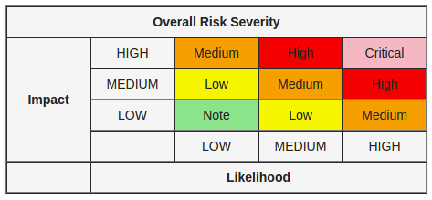

# ImmutableEcosystem

The [Immutable Ecosystem](https://immutablesoft.org) is a hardware and language agnostic Ethereum based application store. This decentralized ecosystem has two main components, the Solidity smart contracts and the Distributed Application (Dapp). This repository is for the Smart Contracts only. The generated API documentation for the smart contracts is located in the 'docs' directory. The unit tests of the smart contracts are located in the 'tests' directory.

##  Bug Bounty 

A bug bounty is in effect for the smart contracts within the Immutable Ecosystem. Adopting vulnerability disclosure best practices we have followed the disclose.io [framework](./core-terms-USA.md) to safeguard security researchers.

To receive the maximum payout the report should include a fix to the problem if possible. Specific payouts to the bug bounty depend on the impact of the bug as well as the general likelihood of the bug. In general, the theft of ETH, tokens or Entity accounts are considered of the highest impact. When calculating the severity and thus payout for reported issues we will utilize the common impact vs. likelihood chart below.

Exemptions: Bugs in the Solidity compiler, third party contracts (ERC20, ENS, etc.), or Ethereum, Optimistic Ethereum and/or EVM or optimistic rollups in general are explicitly not permissible within this bug bounty unless the bug is directly caused by ImmutableSoft's use of these third party components. Also, bugs in the Dapp (once available) are not part of this bug bounty (but please report them if you find them ;-)

The procedure for reporting a bug is to create a Github issue and identify the general problem. To maximize your paybout you then have 15 days to further expand on and discuss the problem and/or develop a solution.  Please do not forget this first step so you can ensure your effort will be rewarded. Bugs discovered during the bounty are awarded in a first come, first served basis. No duplicate bugs will be rewarded, however additional explanations and/or solutions by others may result in the sharing of a particular bounty.

If you do not have time to write up a formal issue report, or wish to remain anonymous, you can submit your report through email. Send your submission directly to Security at ImmutableSoft dot org. Any submission that is acted upon by ImmutableSoft is eligable for a payout. If you wish to decline payment or receive your reward with tokens, please mention this in email.

## Overview

The Immutable Ecosystem is split into six Smart Contracts. The [ActivateToken](https://immutablesoft.github.io/ImmutableEcosystem/docs/ActivateToken.html) is a ERC721 token that activates digital products offered for sale in the Ecosystem. The [ImmutableEntity](https://immutablesoft.github.io/ImmutableEcosystem/docs/ImmutableEntity.html) handles registering and managing orangizations (entities) within the Ecosystem. The [ImmutableProduct](https://immutablesoft.github.io/ImmutableEcosystem/docs/ImmutableProduct.html) is responsible for managing products and their offers of activation by approved entities with the Ecosystem. The [CreatorToken](https://immutablesoft.github.io/ImmutableEcosystem/docs/ImmutableEntity.html) is an ERC721 token that handles the creation and lookup of file releases and Ricardian relations. And finally the [ProductActivate](https://immutablesoft.github.io/ImmutableEcosystem/docs/ProductActivate.html) contract executes product offers by escrowing payment to the product creator before minting new product specific tokens directly to the purchaser.

This project utilizes 'truffle' to build and test the solidity smart contracts. Typical usage after cloning the project includes the following commands issued in the base of the cloned directory. See https://www.trufflesuite.com/ for more information on truffle.

### npm install
### truffle compile --all
### truffle deploy --all
### truffle test

After contract deployment the following ActivateToken contract initialization procedures are taken by the contract owner to make the Ecosystem operational. The first step configures and restricts token transfers to or from the Ecosystem contracts only. See the second javascript test in the file test/TestImmutableEcosystem.js for examples of how to do this.

### restrictToken(address activateAddress, address creatorAddress)

Any use of the Ecosystem before this step are taken is limited. Afterward the Ecosystem is ready for use.

## ImmutableEntity

Individuals and organization can register themselves as entities of either Creator, Distributor, or End User type. Each Entity is assigned a unique index within the Ecosystem upon creation. This index, as well as the Ethereum wallet address used to create the Entity, are thus forth used to uniquely identify the Entity. This smart contract has an interface for the resale of tokens as well as the configuration of an ETH bank account that will be paid out too.

The full public API documentation for this smart contract is available here [ImmutableEntity](https://immutablesoft.github.io/ImmutableEcosystem/docs/ImmutableEntity.html).

## ImmutableProduct

The ImmutableProduct smart contract has interfaces to allow registered entities to create new products and product releases, funding those releases with an escrow holding tokens. Nonprofit creators have this escrow minted for them while commercial creators must transfer tokens to the product release escrow. This contract also handles end user download and authentication verification interfaces as well product release challenges. End users can use this contract to ensure authentic installation of products and to report any discovered file hash mismatch and be rewarded with one half of the outstanding escrow.

The full public API documentation for this smart contract is available here [ImmutableProduct](https://immutablesoft.github.io/ImmutableEcosystem/docs/ImmutableProduct.html).
